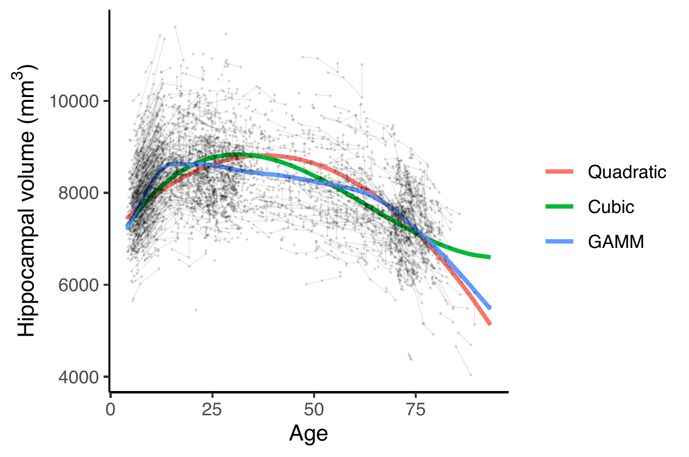
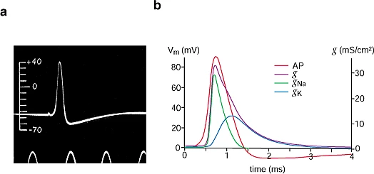
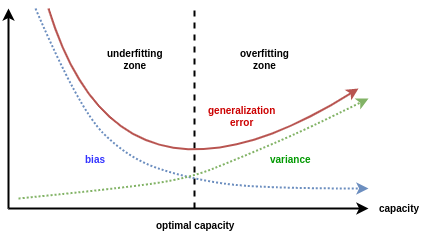

layout: true
    
<div class="my-sidebar"></div> 


```{r setup, echo=FALSE}
knitr::opts_chunk$set(fig.align = "center")
```


---

# Packages we need

```{r, message=FALSE}
library(tidyverse)
library(mgcv)
library(gamm4)
library(gratia)
library(broom)
```

- Slides and source code available at https://github.com/osorensen/LCBC_GAMM_workshop

```{r, echo=FALSE, include=FALSE}
library(latex2exp)
library(numDeriv)
library(patchwork)
```


```{r, echo=FALSE}
dat <- readRDS("data/simdat.rds")
theme_set(theme_bw())
theme_update(text = element_text(size = 20))
```

---

# Simulated example data

```{r, cache=TRUE}
dat %>% 
  select(id, age, sex, icv, genotype, education, hippocampus) %>% 
  head(6)
```

---

# Nonlinear relationships

```{r, fig.width=10, fig.height=5, cache=TRUE}
ggplot(dat, aes(x = age, y = hippocampus, group = id)) +
  geom_point(size = .6) +
  geom_line()
```

---

# Linear regression models not so good

<center>

</center>

Figure from Sørensen et al. (2020), https://doi.org/10.1016/j.neuroimage.2020.117416.


---

# Typical questions

Do the trajectories differ with respect to a categorical variable?

```{r genotype-plot, echo=FALSE, fig.width=10, fig.height=5, cache=TRUE}
ggplot(dat, aes(x = age, y = hippocampus, group = id, color = genotype)) + 
  geom_point(size = .6) + 
  geom_line()
```

---

# Typical questions

Do the trajectories differ with respect to a continuous variable?

```{r edu-plot, echo=FALSE, fig.width=10, fig.height=5, cache=TRUE}
ggplot(dat, aes(x = age, y = hippocampus, group = id, color = education)) +
  geom_point(size = .6) + 
  geom_line()
```

---

# Plan for today

- What are GAMMs?

- GAMMs in R

Short break

- How do we set up interactions?

- How do we avoid overfitting?

---
class: middle, center

# What are GAMMs?

---

# Generalized additive models

.pull-left[
- Performs (generalized) linear regression using basis functions of different shapes:

$$y = \beta_{1} b_{1}(x) + \beta_{2} b_{2}(x) + \beta_{3} b_{3}(x) + \beta_{4} b_{4}(x) + \beta_{5} b_{5}(x) + \epsilon$$
- Much more flexible than linear regression with quadratic terms:

$$y = \beta_{0} + \beta_{1}x + \beta_{2}x^{2} + \epsilon$$

Key references: Hastie and Tibshirani, 1986 (https://doi.org/10.1214/ss/1177013604), Hastie and Tibshirani, 1987 (https://doi.org/10.1080/01621459.1987.10478440).
]
.pull-right[
```{r, echo=FALSE, cache=TRUE}
nb <- 5
csdat <- dat %>% 
  group_by(id) %>% 
  filter(age == min(age)) %>% 
  ungroup()
sm <- smoothCon(s(age, k = nb), data = csdat)[[1]]
basis_functions <- sm$X
dimnames(basis_functions) <- list(NULL, paste0("b", seq_len(nb)))
spline_df <- csdat %>% 
  select(id, age) %>% 
  bind_cols(as_tibble(basis_functions)) %>% 
  pivot_longer(cols = -c(age, id), names_to = "basis")

ggplot(spline_df, aes(x = age, y = value, group = basis, color = basis)) + 
  geom_line()
```

]


---

# Constant


```{r, echo=FALSE, cache=TRUE}
shape_function <- function(weights){
  function_df <- spline_df %>% 
  group_by(id, age) %>% 
  summarise(
    y = as.numeric(t(value) %*% weights),
    .groups = "drop"
  )

ggplot() + 
  geom_line(data = spline_df, aes(x = age, y = value, group = basis, color = basis)) +
  geom_line(data = function_df, aes(x = age, y = y), size = 2, alpha = .5)
}

```

$$\beta = (0, 0, 0, 1, 0)'$$

```{r, echo=FALSE, fig.width=10, fig.height=5, cache=TRUE}
shape_function(c(0, 0, 0, 1, 0))
```


---

# Linear

$$\beta = (0, 0, 0, 1.2, 0.3)'$$

```{r, echo=FALSE, fig.width=10, fig.height=5, cache=TRUE}
shape_function(c(0, 0, 0, 1.2, .3))
```


---

# Pretty nonlinear

$$\beta = (-0.679, -0.486, -0.821, 1.382, 0.86)'$$

```{r, echo=FALSE, fig.width=10, fig.height=5, cache=TRUE}
shape_function(c(-0.679, -0.486, -0.821, 1.382, 0.86))
```

---

# Pretty nonlinear

$$\beta = (1.556, 1.001, 0.355, -0.818, -0.429)'$$

```{r, echo=FALSE, fig.width=10, fig.height=5, cache=TRUE}
shape_function(c(1.556, 1.001, 0.355, -0.818, -0.429))
```

---

# Pretty nonlinear

$$\beta = (-100, -100, 100, 0, 0)'$$

```{r, echo=FALSE, fig.width=10, fig.height=5, cache=TRUE}
shape_function(c(-100, -100, 100, 0, 0))
```

---

# The main idea of GAMMs

- Learn the model - not only the parameters - from data.

--

- In contrast to nonlinear models where the parameters have a well defined meaning, e.g., the Hodgkin-Huxley potential.

<center>

</center>

Image from Häusser (2000), https://doi.org/10.1038/81426

---

# Generalized additive mixed models

- Typical LCBC data has repeated measurements of the same participants.

- GAMM

  - Use random effects to take into account the correlation structure, just like in linear mixed models.

- GAM

  - No random effects, so what you would use with cross-sectional data.
  
  
---

# How smooth or wiggly?

.pull-left[

- How do I know how many basis functions to use?

$$y = \beta_{1} b_{1}(x) + \beta_{2} b_{2}(x) + \dots + \beta_{K} b_{K}(x) + \epsilon$$
- Too smooth or too wiggly?

- Could try lots of different $K$s, but:
  
  - When $K$ gets small, the available functional forms gets quite restricted.
  
  - The actual form of the $b_{k}(x)$ starts to matter ("knot placement").
  
  - And $p$-values don't know that you tried lots of different $K$s.

]
.pull-right[
```{r, echo=FALSE, cache=TRUE}
mod0 <- gamm(hippocampus ~ age_z, random = list(id =~ 1), data = dat)
mod1 <- gamm(hippocampus ~ s(age_z, k = 4, fx = TRUE), random = list(id =~ 1), data = dat)
mod2 <- gamm(hippocampus ~ s(age_z, k = 20, fx = TRUE), random = list(id =~ 1), data = dat)
mod3 <- gamm(hippocampus ~ s(age_z, k = 50, fx = TRUE), random = list(id =~ 1), data = dat)


fit_df <- dat %>% 
  mutate(
    mod0 = predict(mod0$gam, newdata = .),
    mod1 = predict(mod1$gam, newdata = .),
    mod2 = predict(mod2$gam, newdata = .),
    mod3 = predict(mod3$gam, newdata = .)
  ) %>% 
  pivot_longer(cols = mod0:mod3, names_to = "model") %>% 
  mutate(
    modK = factor(model)
  )

levels(fit_df$modK) <- c("Linear", "K=4", "K=20", "K=50")

ggplot(dat, aes(x = age, y = hippocampus, group = id)) + 
  geom_point(size = .6, alpha = .3) + 
  geom_line(alpha = .3) +
  geom_line(data = fit_df, aes(y = value, group = modK, color = modK), size = 2) +
  labs(color = NULL)

```
]


---

# Second derivative smoothing

.pull-left[

- More flexible approach: make sure $K$ is large enough, and penalize wiggliness.

- Define smoothness in terms of squared second derivative.

$$\int f''(x)^2 \text{d}x,$$
$f(x) = \beta_{1} b_{1}(x) + \beta_{2} b_{2}(x) + \dots + \beta_{K} b_{K}(x)$.

- Find parameters $\beta$ minimizing

$$\sum \left(y - f(x) \right)^2 + \lambda \int f''(x)^2 \text{d}x$$
- Smoothing parameter $\lambda$ can (in principle) be found by cross-validation.

]
.pull-right[

```{r, echo=FALSE, include=FALSE, eval=FALSE}
squared_2nd_derivatives <- imap_dfr(
  list(mod0 = mod0$gam, mod1 = mod1$gam, mod2 = mod2$gam, mod3 = mod3$gam), 
  function(mod, nm){
    drv <- if(length(mod$smooth) == 0) {
      0
    } else {
      derivatives(mod, order = 2, term = "s(age_z)", newdata = dat) %>% 
        summarise(h = sum(derivative^2 * 1e-7)) %>% 
        pull(h)
    }
    tibble(
      model = nm,
      h = drv
    )
})
```

```{r, echo=FALSE, cache=TRUE}
fit_df$secderiv <- fit_df$modK  
levels(fit_df$secderiv) <- c("0", "780", "77000", "42800000")

ggplot(fit_df, aes(x = age, y = value, group = secderiv, color = secderiv)) + 
  geom_line(size = 2) +
  labs(color = TeX("$\\int f''(x)^2 dx$")) + 
  ggtitle("Unsmoothed GAMMs")
```

]

---

# Second derivative smoothing


```{r, echo=FALSE, cache=TRUE}
mod0 <- gamm(hippocampus ~ age_z, random = list(id =~ 1), data = dat)
mod1 <- gamm(hippocampus ~ s(age_z, k = 4), random = list(id =~ 1), data = dat)
mod2 <- gamm(hippocampus ~ s(age_z, k = 20), random = list(id =~ 1), data = dat)
mod3 <- gamm(hippocampus ~ s(age_z, k = 50), random = list(id =~ 1), data = dat)

fit_df <- dat %>% 
  mutate(
    mod0 = predict(mod0$gam, newdata = .),
    mod1 = predict(mod1$gam, newdata = .),
    mod2 = predict(mod2$gam, newdata = .),
    mod3 = predict(mod3$gam, newdata = .)
  ) %>% 
  pivot_longer(cols = mod0:mod3, names_to = "model") %>% 
  mutate(
    modK = factor(model)
  )

levels(fit_df$modK) <- c("Linear", "K=4", "K=20", "K=50")
```

- With second derivative smoothing, the number of basis functions no longer matters, as long as it's large enough.

```{r, echo=FALSE, cache=TRUE, fig.width=8, fig.height=5}
ggplot(dat, aes(x = age, y = hippocampus, group = id)) + 
  geom_point(size = .6, alpha = .3) + 
  geom_line(alpha = .3) +
  geom_line(data = fit_df, aes(y = value, group = modK, color = modK), size = 2) +
  labs(color = NULL) +
  ggtitle("Smoothed GAMMs")
```

---

class: middle, center

# GAMMs in R

---

# Packages


```{r, eval=FALSE}
library(mgcv)
```

- Very comprehensive.


```{r, eval=FALSE}
library(gamm4)
```

- Sometimes better for fitting GAMMs.

---

# Hippocampus trajectory


```{r, fig.width=8, fig.height=4, cache=TRUE, echo=FALSE}
ggplot(dat, aes(x = age, y = hippocampus, group = id)) +
  geom_point(size = .6) +
  geom_line()
```


```{r, eval=FALSE}
mod <- gamm4(
  formula = hippocampus ~ s(age) + icv + sex, # formula for GAM
  random = ~(1 | id), # random intercept for each participant (ID)
  data = dat
)
```

---

# Hippocampus trajectory

```{r, warning=TRUE, message=TRUE, cache=TRUE}
mod <- gamm4(
  formula = hippocampus ~ s(age, k = 15) + icv + sex, # formula for GAM
  random = ~(1 | id), # random intercept for each participant (ID)
  data = dat
)
```

--

```{r, cache=TRUE}
range(dat$age)
range(dat$icv)
```


---

# Hippocampus trajectory


- Scale to mean 0 and standard deviation 1:

```{r, eval=FALSE}
dat$age_z <- (dat$age - mean(dat$age)) / sd(dat$age)
dat$icv_z <- (dat$icv - mean(dat$icv)) / sd(dat$icv)
```


```{r, cache=TRUE}
range(dat$age_z)
range(dat$icv_z)
```

---

# Hippocampus trajectory

- Try again

```{r, cache=TRUE}
mod <- gamm4(
  formula = hippocampus ~ s(age_z, k = 15) + icv_z + sex, # formula for GAM
  random = ~(1 | id), # random intercept for each participant (ID)
  data = dat
)
```

- We get two things back

```{r, cache=TRUE}
str(mod, max.level = 1)
```

---


```{r, cache=TRUE, collapse=FALSE}
summary(mod$gam)
```

---

# Visualization

.pull-left[
- `gratia` gives ggplot-style output:

```{r, fig.width=5, fig.height=5, cache=TRUE}
library(gratia)
draw(mod$gam, parametric = FALSE)
```
]
.pull-right[
- But `mgcv` also has plotting function:

```{r, fig.height=6}
par(cex=1.5)
plot(mod$gam, scheme = 1)
```

]


---

# Enough basis functions?

- Our model used `k=15`. 

- Try `k=4`:

```{r, cache=TRUE}
mod0 <- gamm4(
  formula = hippocampus ~ s(age_z, k = 4) + icv_z + sex, # formula for GAM
  random = ~(1 | id), # random intercept for each participant (ID)
  data = dat
)
```

---

# K-index

- Permutation test:

```{r, cache=TRUE}
k.check(mod$gam)
k.check(mod0$gam)
```

- Evidence that $K$ is too low:

  - `k-index` below 1
  - `p-value` close to 0
  - `edf` close to `k'`

See `?k.check`. Citation: Wood (2017, Chapter 5.9). (https://www.routledge.com/Generalized-Additive-Models-An-Introduction-with-R-Second-Edition/Wood/p/book/9781498728331)

---

# Confidence intervals

- For parametric terms, everything works as usual:

```{r, cache=TRUE}
library(broom)
tidy(mod$gam, parametric = TRUE, conf.int = TRUE, conf.level = 0.95)
```

- Can also get some summaries for smooth term:

```{r, cache=TRUE}
tidy(mod$gam, parametric = FALSE)
```

---

# Confidence intervals for smooth terms

- Create new set of values over which to plot:

```{r, cache=TRUE}
grid <- crossing(
  age = seq(from = 4, to = 95, by = 1),
  sex = c("Female", "Male"), icv_z = 0
) %>% 
  mutate(age_z = (age - mean(dat$age)) / sd(dat$age))
```

- Compute predictions at those values:

```{r, cache=TRUE}
predictions <- predict(mod$gam, newdata = grid, se.fit = TRUE)
str(predictions)
```

---

# Confidence intervals for smooth terms

.pull-left[
- Put predictions in grid and plot

```{r, cache=TRUE}
grid <- grid %>% 
  mutate(
    pred = predictions$fit,
    se = predictions$se.fit,
    pred_lower = pred - 1.96 * se,
    pred_upper = pred + 1.96 * se
  )
```

```{r ci-plot, eval=FALSE}
ggplot(grid, aes(
  x = age, y = pred, group = sex,
  ymin = pred_lower, ymax = pred_upper)) + 
  geom_line(aes(color = sex)) +
  geom_ribbon(aes(fill = sex), alpha = .4) +
  ylab("Hippocampal volume") + 
  xlab("Age") +
  labs(color = NULL, fill = NULL)
```
]
--

.pull-right[

```{r ci-plot-out, ref.label="ci-plot", echo=FALSE,cache=TRUE}
```

]

---

# There's always a catch


.pull-left[

- We did $\hat{f} \pm 1.96 \hat{\sigma}$

  - This is a *pointwise* confidence interval

  - Gives 95 % confidence along the x-axis!

  - We are not "95 % sure" that the true function lies within the confidence bands.


Marra and Wood (2012), https://doi.org/10.1111/j.1467-9469.2011.00760.x
]
.pull-right[
```{r ci-plot-out, ref.label="ci-plot", echo=FALSE,cache=TRUE}
```
]

---

# Simultaneous confidence intervals

.pull-left[

- Need something bigger than 1.96.

- `gratia` can help us

```{r, cache=TRUE}
crit <- confint(mod$gam, parm = "s(age_z)", 
        type = "simultaneous") %>% 
  distinct(crit) %>% 
  pull()

crit
```

```{r, cache=TRUE}
grid <- grid %>% 
  mutate(
    pred_lower_sim = pred - crit * se,
    pred_upper_sim = pred + crit * se
  )
```


]
.pull-right[

- `sex = "Female"`. The outer bands are simultaneous CIs.

```{r sim-ci-plot, cache=TRUE, echo=FALSE, fig.height=4, fig.width=6}
ggplot(filter(grid, sex == "Female"), aes(
  x = age, y = pred)) + 
  geom_line(aes()) +
  geom_ribbon(aes(ymin = pred_lower, ymax = pred_upper), alpha = .3) +
  geom_ribbon(aes(ymin = pred_lower_sim, ymax = pred_upper_sim), alpha = .3) +
  ylab("Hippocampal volume") + 
  xlab("Age") +
  labs(color = NULL, fill = NULL)
```

]


---

class: middle, center

# Short break

---

class: middle, center

# Interactions

---

# Interactions

.pull-left[

- How does the curve vary with

  - Categorical variables?
  
  - Continuous variables?

]
.pull-right[

```{r, ref.label='sim-ci-plot', echo=FALSE, cache=TRUE}
```

]

---

# Interaction with categorical variables


```{r, ref.label='genotype-plot', echo=FALSE, fig.width=10, fig.height=5, cache=TRUE}
```


---

# Data preparation

- Need `factor`s or `ordered.factor`s:

```{r, cache=TRUE}
dat$genotype_fct <- factor(dat$genotype)
dat$genotype_ord <- ordered(dat$genotype)

table(dat$genotype_fct)
class(dat$genotype_fct)
class(dat$genotype_ord)
```

---

# Factor by-variable

- Try with `factor` first:

```{r, cache=TRUE}
mod_fac <- gamm4(
  formula = hippocampus ~ s(age_z, by = genotype_fct) + 
    genotype_fct + sex + icv_z,
  random = ~(1 | id), data = dat
)
```

- One smooth per factor level:

```{r, cache=TRUE}
tidy(mod_fac$gam)
```

---

# Factor by-variable

```{r, cache=TRUE}
grid <- crossing(
  age = seq(from = 4, to = 95, by = 1),
  genotype_fct = c("A", "B", "C"), sex = "Female", icv_z = 0
) %>% 
  mutate(age_z = (age - mean(dat$age)) / sd(dat$age), genotype_ord = genotype_fct)

grid$fit <- predict(mod_fac$gam, newdata = grid)
```

```{r, cache=TRUE, echo=FALSE, fig.width=7, fig.height=4}
ggplot(grid, aes(x = age, y = fit, group = genotype_fct, color = genotype_fct)) + 
  geom_line() +
  labs(color = "genotype") +
  ylab("hippocampal volume")
```

---

# Ordered factor by-variable

- If we believe the trajectories are somewhat similar, the `factor` approach wastes power, since it estimates all of them completely independently.

- We can use `ordered.factor` instead (note the addition of `s(age_z)`):

```{r, cache=TRUE}
mod_ord <- gamm4(
  formula = hippocampus ~ s(age_z) + s(age_z, by = genotype_ord) + 
    genotype_ord + sex + icv_z,
  random = ~(1 | id), data = dat
)
```

--

- Main effect, plus deviations from main effect for levels B and C:

```{r, cache=TRUE}
tidy(mod_ord$gam)
```

---

# Ordered factor by-variable

- Strange confidence intervals!

```{r, fig.height=5, fig.width=12, cache=TRUE}
par(mfrow = c(1, 3), cex = 1.3)
for(i in 1:3) plot(mod_ord$gam, scale = 0, select = i, scheme = 1)
```


---

# Ordered factor by-variable

- Can be fixed!

```{r, fig.height=5, fig.width=12, cache=TRUE}
par(mfrow = c(1, 3), cex = 1.3)
for(i in 1:3) plot(mod_ord$gam, scale = 0, select = i, scheme = 1, seWithMean = TRUE)
```


---

# Can still visualize


```{r, cache=TRUE}
grid$fit_ord <- predict(mod_ord$gam, newdata = grid)
```

```{r, cache=TRUE, fig.width=7, fig.height=4}
ggplot(grid, aes(x = age, y = fit_ord, group = genotype_ord, color = genotype_ord)) + 
  geom_line() + 
  labs(color = "genotype") +
  ylab("hippocampal volume")
```

---

# Linear model analogy

- Model with `factor` by-variable is like:

```{r, cache=TRUE}
lm(hippocampus ~ genotype + genotype : age_z, data = dat) %>% coef()
```

--


- Model with `ordered.factor` by-variable is like:

```{r, cache=TRUE}
lm(hippocampus ~ genotype * age_z, data = dat) %>% coef()
```

- Linear models identical, GAMMs are not.

---

# Summary - interaction with categorical variables

- You typically want `grp` to be an `ordered.factor`.

- Set up with `s(x) + grp + s(x, by = grp)`.

---

# Interaction with continuous variables

```{r, echo=FALSE, ref.label='edu-plot', cache=TRUE, fig.width=10, fig.height=5}
```

---

# Take a look

- Where is it nonlinear?

```{r, echo=FALSE, fig.width=12, fig.height=5, cache=TRUE}
library(patchwork)
p1 <- ggplot(dat, aes(x = education, y = hippocampus, group = id)) + 
  geom_point(size = .3) +
  geom_line()
p2 <- ggplot(dat, aes(x = age, y = hippocampus, group = id)) + 
  geom_point(size = .3) +
  geom_line()

p1 + p2
```

---

# Interaction

| Type | Formula | Works with |
| ---- | ---- | ---- |
| Linear in both | `hippocampus ~ age * edu` | `gamm()`, `gamm4()` |
| Linear in `edu`, smooth in `age` | `hippocampus ~ s(age) + s(age, by = edu)` | `gamm()`, `gamm4()` |
| Linear in `agee`, smooth in `edu` | `hippocampus ~ s(edu) + s(edu, by = age)` | `gamm()`, `gamm4()` |
| Smooth in both | `hippocampus ~ te(age, edu)` | `gamm()` |
| Smooth in both | `hippocampus ~ s(age) + s(edu) + ti(age, edu)` | `gamm()`|
| Smooth in both | `hippocampus ~ t2(age, edu)` | `gamm()`, `gamm4()` |

---

# Linear in both


```{r,cache=TRUE}
mod <- gamm4(
  formula = hippocampus ~ age_z * education_z + icv_z + sex, 
  random = ~(1|id), data = dat
)
```

```{r, cache=TRUE}
tidy(mod$gam, parametric = TRUE)
```

---

# Linear in both

```{r, warning=FALSE, cache=TRUE}
vis.gam(mod$gam, theta = 30, view = c("age_z", "education_z"))
```


---

# Smooth in age, linear in education

- Note, no separate `education_z` term.

```{r,cache=TRUE}
mod <- gamm4(
  formula = hippocampus ~ s(age_z) + s(age_z, by = education_z) + icv_z + sex, 
  random = ~(1|id), data = dat
)
```

```{r, cache=TRUE}
tidy(mod$gam, parametric = FALSE)
```

---

# Smooth in age, linear in education

```{r, warning=FALSE, cache=TRUE}
vis.gam(mod$gam, theta = 30, view = c("age_z", "education_z"))
```

---

# Smooth in age, linear in education

- Varying-coefficient model: `s(age) + s(age, by = edu)` means $f(age) + \beta(age) * edu$.

Hastie and Tibshirani (1993), https://doi.org/10.1111/j.2517-6161.1993.tb01939.x

```{r, cache=TRUE, fig.width=12, fig.height=5}
par(mfrow = c(1, 2), cex = 1.5)
for(i in 1:2) plot(mod$gam, select = i, scale = 0, scheme = 1, seWithMean = TRUE)
```

---

# Smooth in both

- Can use `t2()`, or `te()`, which are almost equivalent from a practical perspective.

```{r,cache=TRUE}
mod <- gamm4(
  formula = hippocampus ~ t2(age_z, education_z, k = c(15, 5)) + icv_z + sex, 
  random = ~(1|id), data = dat
)
```

```{r, cache=TRUE}
tidy(mod$gam, parametric = FALSE)
```


---

# Smooth in both

```{r, warning=FALSE, cache=TRUE}
vis.gam(mod$gam, theta = 30, view = c("age_z", "education_z"))
```

---

# But I want to see the interaction term!

- Use `ti()`, and `gamm()` instead of `gamm4()`

```{r,cache=TRUE}
mod <- gamm(
  formula = hippocampus ~ s(age_z, k = 15) + s(education_z, k = 5) + 
    ti(age_z, education_z, k = c(5, 5), bs = "tp") + icv_z + sex, 
  random = list(id =~ 1), data = dat
)
```

```{r, cache=TRUE}
tidy(mod$gam, parametric = FALSE)
```


---

# Interaction terms

```{r, fig.width=14, fig.height=6, cache=TRUE}
par(mfrow = c(1, 3), cex = 1.3)
for(i in 1:3) plot(mod$gam, scale = 0, select = i, seWithMean = TRUE, scheme = 1)
```

---

class: middle, center

# How do we avoid overfitting?

---

# What is overfitting?


```{r, echo=FALSE}
set.seed(123)
samples <- 100
f2 <- function(x) {
  0.2 * x^11 * (10 * (1 - x))^6 + 10 * 
      (10 * x)^3 * (1 - x)^10
}
simdat <- map_dfr(seq_len(samples), function(i){
  tibble(x = runif(100)) %>% 
    mutate(y = f2(x) + rnorm(nrow(.)))
}, .id = "sample")

```


```{r, echo=FALSE, cache=TRUE}
grid <- tibble(x = seq(from = 0, to = 1, by = .01))
models <- simdat %>% 
  nest_by(sample) %>% 
  mutate(
    grid = list(grid),
    underfit = list(predict(lm(y ~ x + I(x^2), data = data), newdata = grid)),
    overfit = list(predict(gam(y ~ s(x, k = 50, fx = TRUE, bs = "cr"), data = data), newdata = grid))
  ) %>% 
  unnest(cols = c(grid, underfit, overfit)) %>% 
  select(-data) %>% 
  pivot_longer(cols = c(underfit, overfit), names_to = "model", values_to = "fit")
```


```{r overfit-plot, echo=FALSE, eval=FALSE}
ggplot(filter(models, sample %in% 1:4), aes(x = x)) + 
  geom_line(aes(y = fit, group = model, color = model)) +
  geom_point(data = filter(simdat, sample %in% 1:4), aes(y = y), size = .6) +
  facet_wrap(vars(sample), labeller = as_labeller(function(x) paste("Sample", x))) +
  labs(color = NULL)
```


```{r, ref.label='overfit-plot', echo=FALSE, fig.height=6, fig.width=12}
```


---
# The long-run perspective

- Fundamental assumption

  - Our data is a random *sample* from a *population*.

- Remember

  - P-values do not tell us whether effects are real. They tell us how frequently effects of the observed size or bigger are expected to happen under repeated random sampling from the population.

--

- Similarly

  - For a single sample (our data), we cannot compare two models and say that one is overfit and another is not. We must instead resort to procedures which strike the right balance between over- and underfitting under repeated random sampling.
  
For details: Hastie, Tibshirani, Freedman, 2009. Elements of Statistical Learning, Chapter 7 (https://web.stanford.edu/~hastie/ElemStatLearn/).

---
# Bias and variance

.pull-left[

- We deal with overfitting by minimizing expected mean squared error:

$$\text{MSE} = \text{Bias}^{2} + \text{Variance}$$
- Overfitted models have low bias and high variance

  - Differ a lot between samples, but on average correct.
  
- Underfitted models have high bias and low variance

  - Differ little between samples, but on average wrong.

]
.pull-right[

- Fits for 100 random samples:

```{r, echo=FALSE, cache=TRUE, fig.height=5}
grid %>% 
  mutate(
    model = "truth",
    fit = f2(x),
    sample = "nothing"
  ) %>% 
  bind_rows(models) %>% 
  mutate(model = factor(model, levels = c("overfit", "underfit", "truth"))) %>% 
  ggplot(aes(x = x, y = fit, group = interaction(model, sample), 
             color = model, alpha = model, size = model)) + 
  geom_line() +
  scale_color_manual(
    breaks = c("overfit", "underfit", "truth"),
    values = c("red", "blue", "black")
  ) +
  scale_alpha_manual(
    breaks = c("overfit", "underfit", "truth"),
    values = c(.5, .5, 1)
  ) +
  scale_size_manual(
    breaks = c("overfit", "underfit", "truth"),
    values = c(.5, .5, 1)
  )
```

]

---

# Bias-variance tradeoff

<center>

</center>

Figure from https://djsaunde.wordpress.com/2017/07/17/the-bias-variance-tradeoff/.


---

# In terms of GAMs and GAMMs

- Given a smoothing parameter $\lambda$, we minimize

$$\sum \left(y - f(x) \right)^2 + \lambda \int f''(x)^2 \text{d}x$$
- What is the optimal value of $\lambda$?

---

# Methods for finding the right balance


- Cross-validation

  - `gam()` uses generalized cross-validation by default (`method = "GCV.Cp"`). More conservative double cross-validation obtained with (`gamma = 1.5`).
  
  - Cross-validation does not make sense with repeated measurements, unless you really know what you're doing.
  
- Marginal and restricted maximum likelihood (ML/REML)

  - Default with GAMMs.

  - Less variable than cross-validation, so a good option also for `gam()`.
  
--

- The methods in `mgcv` and `gamm4` estimate smoothing parameters as part of the model, so uncertainty about smoothing is properly propagated into standard errors and $p$-values.

  - In contrast to knot selection or k-fold cross-validation, where model complexity is treated as fixed when the final model is computed, risking underestimation of uncertainty.
  
---

# Theory meets practice


```{r, echo=FALSE, cache=TRUE}
set.seed(9933)
df <- gamSim(n = 100, verbose = FALSE) %>% 
  select(x2, y) %>% 
  rename(x = x2)

b <- gam(y ~ s(x), data = df, gamma = 1.5)
grid <- tibble(x = seq(from = 0, to = 1, by = .01))
pred <- predict(b, newdata = df, se.fit = TRUE)

conf_levels <- c(.50, .95, .999)
crits <- map_dbl(conf_levels, function(l){
  confint(b, parm = "s(x)", level = l, type = "simultaneous") %>% 
  distinct(crit) %>% 
  pull()
}) 


df2 <- df %>% 
  mutate(
    fit = pred$fit,
    se = pred$se,
    standard_errors = list(crits)
  ) %>% 
  unnest(cols = standard_errors) %>% 
  mutate(
    ymin = fit - standard_errors * se,
    ymax = fit + standard_errors * se
  )

```


```{r, echo=FALSE, fig.height=5, fig.width=10, cache=TRUE}
ggplot(df2, aes(x = x, y = fit, group = standard_errors)) + 
  geom_line()
```

> "That dip at x ≈ 0.50 is not real!"


---

# Show the uncertainty

```{r, echo=FALSE, fig.height=5, fig.width=10, cache=TRUE}
annotation <- tibble(
  x = 1.035,
  y = c(8, 9.5, 11),
  label = c("50.0% CI", "95.0% CI", "99.9% CI")
)

ggplot(df2, aes(x = x, y = fit)) + 
  geom_line(aes(group = standard_errors)) + 
  geom_ribbon(alpha = .3, aes(ymin = ymin, ymax = ymax, group = standard_errors)) +
  geom_text(data = annotation, aes(x = x, y = y, label = label))
```

- Simultaneous confidence intervals

---

# Show the uncertainty


```{r, echo=FALSE, fig.height=5, fig.width=10, cache=TRUE}
set.seed(3247)
nmc <- 100
Xp <- predict(b, type = "lpmatrix", newdata = grid)
betas <- rmvn(nmc, coef(b), vcov(b, unconditional = TRUE))
fits <- Xp %*% t(betas)

grid %>% 
  mutate(iteration = list(seq_len(nmc))) %>% 
  unnest(cols = iteration) %>% 
  mutate(
    fit = c(t(fits))
  ) %>% 
  ggplot(aes(x = x, y = fit, group = iteration)) + 
  geom_line(alpha = .4)
  
```

- 100 samples from posterior distribution of f(x)


---

class:middle, center

# Almost done

---

# Some references

- **Contains everything, pretty technical**: Wood S. 2017. Generalized Additive Models: An Introduction with R. (https://www.routledge.com/Generalized-Additive-Models-An-Introduction-with-R-Second-Edition/Wood/p/book/9781498728331)

- **Very well written, for applications in ecology**: Pedersen EJ, Miller DL, Simpson GL, Ross N. 2019. Hierarchical generalized additive models in ecology: an introduction with mgcv. PeerJ 7:e6876 https://doi.org/10.7717/peerj.6876

- **Neuroimaging use cases**: Sørensen Ø, Walhovd KB, Fjell AM. 2020. A Recipe for Accurate Estimation of Lifespan Brain Trajectories, Distinguishing Longitudinal and Cohort Effects. Accepted for publication in NeuroImage. https://arxiv.org/abs/2007.13446


Slides and source code available at https://github.com/osorensen/LCBC_GAMM_workshop

---

class: middle, center

# The end